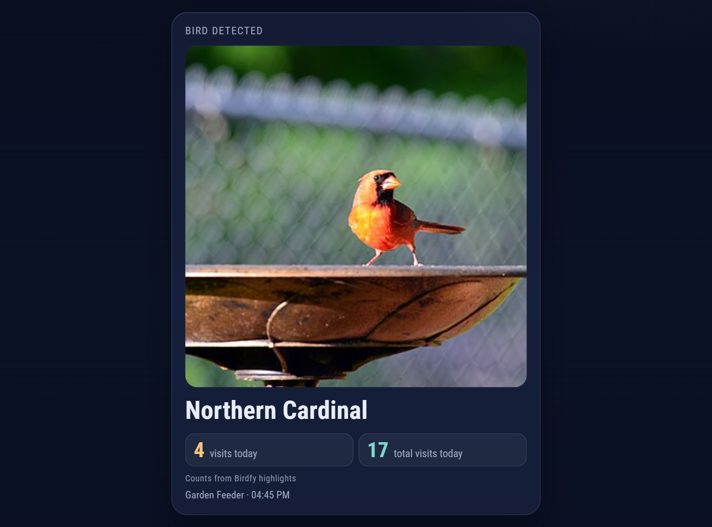

# MMM-Birdfy

A [MagicMirror²](https://magicmirror.builders) module that displays bird-detection alerts from your **Birdfy** smart feeder camera — showing the recorded video clip, a thumbnail, or a live stream whenever a bird is spotted.

<p align="center">
  
</p>

*An alert card in the night theme: the detected species, its visits today and total visits today
(rendered with the built-in `BIRDFY_DEMO` notification; photo: "Male Northern Cardinal", public
domain, via Wikimedia Commons).*

---

## Features

- Large glass alert card on every bird detection: the captured image fills the card width (configurable aspect ratio, rounded corners), with the species name prominent
- Shows "N visits today" for that species and "M total visits today" for all birds. The card says where the counts come from. With the current Home Assistant integration these are detections the mirror observed itself (one per species per feeder per day); Birdfy highlights are used when available. Neither is every motion event
- Idle view lists today's visitors with their counts and the day's total
- Alert time is counted from when the module is first visible, so it works on a rotating page (MMM-pages) via `suspend`/`resume`; optionally jumps to its own page on a fresh alert and holds rotation there (`pageOnAlert`, `alertPage`)
- Day and night themes follow the shared `--mm-*` theme variables, with a placeholder when an image or clip fails to load
- Supports optional **live view** instead of the recorded clip
- Auto-dismisses after a configurable duration and returns to idle state
- Three integration modes: **Home Assistant** (recommended; push, all feeders), **direct cloud polling**, or **webhook push**
- Broadcast `BIRDFY_DEMO` notification from any other module for testing

---

## Installation

```bash
cd ~/MagicMirror/modules
git clone <this repository's clone URL> MMM-Birdfy
cd MMM-Birdfy
npm install
```

---

## Update

```bash
cd ~/MagicMirror/modules/MMM-Birdfy
git pull
npm install --omit=dev
```

Then restart MagicMirror (for example `pm2 restart MagicMirror`).

## Configuration

Add to the `modules` array in `config/config.js`:

```javascript
{
  module: "MMM-Birdfy",
  position: "top_right",   // any MagicMirror region
  config: {
    // ── Home Assistant mode (recommended; see "Home Assistant mode") ─
    // source:  "homeassistant",
    // haUrl:   "https://your-ha-host:8123",
    // haToken: "<long-lived access token>",
    // feeders: [{ name, speciesEntity, imageEntity }],  // optional, auto-discovered

    // ── Mode A: Birdfy highlights polling ─────────────────────────
    sources: [
      { name: "Bird Feeder", uuid: "your-share-uuid" },
      { name: "Bird House",  uuid: "another-share-uuid" },
    ],
    pollInterval: 120000,     // check every 2 min
    maxAlertAge: null,        // ignore visits older than this (ms); null = 30 min cloud, 60 min Home Assistant

    // ── Mode B: Webhook (IFTTT / Home Assistant / etc.) ───────────
    webhookEnabled: false,    // set true to enable
    webhookPort:    8765,
    webhookPath:    "/birdfy",
    webhookHost:    "127.0.0.1",  // localhost only by default; see "Security" below
    webhookToken:   "",           // set a shared secret to require it on every request

    // ── Display ───────────────────────────────────────────────────
    displayDuration: 60000,   // show alert for 60 s of visible time
    cardWidth:       560,     // card width in px
    imageAspect:     "1/1",   // CSS aspect-ratio of the captured image (Birdfy covers are square)
    pageOnAlert:     false,   // jump to this module's MMM-pages page on alert
    alertPage:       null,    // that page's index (0-based), needed for pageOnAlert
    showVideo:       true,    // play video clip if available
    showLiveView:    false,   // prefer live stream over clip
    showWhenIdle:    true,    // show idle state between alerts
    maxVisitors:     8,       // max species rows in the today's-visitors list
    animationSpeed:  1000,
  }
},
```

---

## Integration Modes

### Home Assistant mode (recommended)

Set `source: "homeassistant"`. The node helper keeps one WebSocket open to Home Assistant (push, no polling) and reads the [Birdfy integration](https://github.com/dakahler/homeassistant-birdfy) (v1.1) entities for **all** your feeders. `sources` is ignored in this mode; `webhookEnabled` still works if you also want the webhook.

Your Home Assistant long-lived access token is used only by the node helper and is only ever sent to Home Assistant; the helper never puts it in a notification to the browser. Be aware, though, that **anything in `config.js` is served to browsers**: MagicMirror hands the whole configuration to the renderer and serves it unauthenticated at `http://<mirror>:8080/config/` to anyone on your LAN who can reach the mirror. A token written as `haToken` in `config.js` is therefore readable that way (like any other module's keys). To keep it out of the served config, leave `haToken` unset and supply it server-side instead, either as `haTokenFile: "/path/to/token.txt"` (a file containing only the token, readable by the MagicMirror user, `chmod 600`) or in the `BIRDFY_HA_TOKEN` environment variable of the MagicMirror process. Precedence: `haToken`, then `haTokenFile`, then `BIRDFY_HA_TOKEN`. Create the token under your HA profile, "Security", "Long-lived access tokens".

**What counts as a visit.** The integration only exposes Birdfy's curated highlights, polled from the Birdfy cloud every 15 minutes, and in practice the `highlights` attribute is usually empty. With the current integration (v1.1) the module therefore typically sees **one detection per new species per feeder per day** (a species appearing in the sensor's species list), so most counts are 1 and "M total visits today" equals the number of species seen; a repeat visit by a species already listed today cannot be seen. When highlight items are present they are counted instead (per local day, all feeders summed, the same clip on two feeders counted once). The card labels which kind of count it shows (`countSource`: "highlights", "detections", or "mixed"). Expect an alert up to roughly 15 minutes after the visit, plus whatever delay Birdfy has in publishing it.

**How detection works.**

1. A new item in a feeder's `highlights` attribute (stable key `time|species|video_url`) raises an alert and carries the clip URL.
2. Fallback, used because the live `highlights` attribute is usually empty even while the species sensor lists a bird: a species newly present in `species_list` (or in the sensor state) raises an alert, counted as one "detection seen by this mirror" (`countSource: "detections"`). The integration also writes a `last_detection` attribute, but only when highlight items exist; the module watches it for an already-known species only when `highlights` itself is empty, which with v1.1 means this path rarely or never triggers. Do not expect repeat-visit alerts.
3. Optional, off by default (`imageChangeDetection`): a change of the `image.*_last_bird` timestamp that does not match a known highlight. That entity also ticks on every HA restart, so it is ignored for 60 s after connecting and when the new state equals the old one (token rotation).

The generic Birdfy label "bird" is never announced or counted. When several new items arrive in one update only the newest raises an alert; all of them are counted. Alerts older than `maxAlertAge` are counted but not shown. `maxAlertAge: null` (the default) means 60 minutes in Home Assistant mode and 30 minutes in cloud mode; any number is used as given, so `1800000` really means 30 minutes in both.

**Restarts and reloads.** Seen items and counts are stored in `birdfy-state.json` in the module folder (today only; safe to delete). A MagicMirror restart or browser reload does not re-announce today's birds. On the very first run (no file) the first snapshot only primes: it counts what is already there but announces nothing. After that, a bird that arrived while the mirror was down is announced on the next start if it is newer than `maxAlertAge`.

**Midnight.** Counts reset at local midnight. The integration keeps yesterday's attributes until its next refresh, so attributes whose `start_time` is before today are ignored.

**Images.** The browser gets the public Birdfy URL where there is one: the species cover from the sensor's `thumbnails`, or the `image_url` attribute of the `image.*_last_bird` entity. Note that this is Birdfy's per-species cover picture, not a frame from that exact visit; the integration exposes nothing more specific. Only if neither exists does the module serve the HA image entity through `GET /birdfy/image/<feeder index>` on MagicMirror's own web server, fetching it from HA with the token server-side. That route works even with `webhookEnabled: false`.

**TLS.** The WebSocket and image proxy verify the HA certificate. If HA uses a self-signed certificate, set `haAllowSelfSigned: true`.

**Feeders.** If you omit `feeders`, the module discovers every `sensor.*_bird_species` (not the `_count`, `_last_bird_species` or `_new_species_today` siblings) and pairs it with `image.<same prefix>_last_bird`. List them explicitly to choose the display names or to limit which feeders are used.

Full example for three feeders. On this mirror Birdfy has its own MMM-pages page (page index 4, class `page4`), alone apart from the fixed clock:

```javascript
{
  module: "MMM-Birdfy",
  position: "middle_center",   // its own page, below the fixed clock
  classes: "page4",            // MMM-pages: modules: [..., ["page4"]]
  config: {
    source: "homeassistant",
    haUrl: "https://ha.example.com:8123",
    haTokenFile: "/home/pi/MagicMirror/config/birdfy-ha-token",  // file holding only the token (recommended: config.js is served to browsers)
    // haToken: "<long-lived access token>",   // alternative; ends up in the served config
    feeders: [
      { name: "Feeder",     speciesEntity: "sensor.birdfy_bird_feeder_bird_species",      imageEntity: "image.birdfy_bird_feeder_last_bird" },
      { name: "Bird House", speciesEntity: "sensor.birdfy_bird_house_bird_species",        imageEntity: "image.birdfy_bird_house_last_bird" },
      { name: "Backyard",   speciesEntity: "sensor.backyard_birdfy_metal_4k_bird_species", imageEntity: "image.backyard_birdfy_metal_4k_last_bird" },
    ],
    maxAlertAge: 3600000,      // 60 min (the Home Assistant mode default)
    displayDuration: 60000,    // counted from when the alert is first visible
    cardWidth: 560,
    imageAspect: "1/1",
    pageOnAlert: true,         // jump to this module's page on a fresh alert
    alertPage: 4,              // 0-based MMM-pages index of the page4 entry
    // imageChangeDetection: false,
    // haAllowSelfSigned: false,
  }
},
```

### Mode A — Birdfy Highlights Polling

Add one entry to `sources` per Birdfy feeder, each with the share UUID from the Birdfy app (the same UUID the Home Assistant Birdfy integration uses). No account login is needed. The node helper polls `https://api2.nvts.co/moments/h5CuratedData` for today's data every `pollInterval` milliseconds and shows two kinds of events:

- **Species sightings** — the first time an identified species appears in today's `birdList`, with Birdfy's cover photo for that species. This is the frequent signal; Birdfy's share feed does not expose exact sighting times or repeat visits, so each species is announced once per day.
- **Curated clips** — highlights Birdfy selects (typically a few per week), with the video clip, shown if newer than `maxAlertAge`.

#### Getting (or renewing) a share UUID

1. Open the Birdfy app and tap your profile image (top right).
2. Select **Highlights**. A browser page opens.
3. Copy that page's URL; the UUID is the value after `uuid=`
   (`https://highlight.birdfy.com/?uuid=YOUR_UUID_HERE`).

Birdfy can invalidate these links (for example after an app update). An invalid UUID
returns an empty feed rather than an error, so when a source has no highlights today the
module also checks Birdfy's highlight summary for the last ~2 months (at most every 6 hours).
If that is empty too, it logs a warning and the idle view shows
`Birdfy link expired: <source name>` until the source returns data again.

### Mode B — Webhook

Set `webhookEnabled: true`. The module starts an Express server on `webhookPort` (default `8765`) at `webhookPath` (default `/birdfy`).

POST a JSON payload to `http://<mirror-ip>:8765/birdfy` to trigger an alert:

```json
{
  "species":    "House Sparrow",
  "deviceName": "Garden Feeder",
  "timestamp":  1700000000000,
  "videoUrl":   "https://example.com/clip.mp4",
  "imageUrl":   "https://example.com/cover.jpg",
  "streamUrl":  "https://example.com/live.mjpg"
}
```

All fields are optional; only recognised fields are displayed. `videoUrl`/`imageUrl`/`streamUrl` must be `http://` or `https://` URLs — anything else (e.g. `rtmp://`) is silently dropped. `streamUrl` (used when `showLiveView: true`) is rendered as an `` tag, so it must point at an MJPEG stream or a still/snapshot URL, not an RTMP or HLS (`.m3u8`) address.

#### Security

By default the webhook server binds to `127.0.0.1` (localhost) and is **not** reachable from the rest of your network — only processes on the mirror itself (or an SSH tunnel) can reach it. It also has no authentication unless you set `webhookToken`.

- **To let another host on your LAN (e.g. a Home Assistant server) reach the webhook**, set `webhookHost: "0.0.0.0"` in the module config. Once you do this, anyone on your LAN can reach the endpoint, so also set `webhookToken` to a random shared secret.
- **To require a shared secret**, set `webhookToken: "<a long random string>"`. Callers must then send it as either:
  - an `Authorization: Bearer <token>` header, or
  - a `?token=<token>` query parameter (useful for services like IFTTT that can't set custom headers).

  Requests without a valid token receive `HTTP 401`.

#### Setting up IFTTT

The webhook binds to `127.0.0.1` by default, which IFTTT — a cloud service — cannot reach at
all. To use IFTTT you must both expose the webhook and require a token:

1. Set `webhookHost: "0.0.0.0"` and `webhookToken: "<a long random string>"` in the module
   config, then make `webhookPort` reachable from the public internet (e.g. a reverse proxy
   or a tunnel such as Cloudflare Tunnel/ngrok/Tailscale Funnel — do not port-forward straight
   to your mirror without at least the token set). IFTTT cannot set custom headers, so the
   token must go in the URL's query string.
2. Create an IFTTT applet: **If** Birdfy notification → **Then** Webhooks (make a web request).
3. Set the URL to `https://<your-public-endpoint>/birdfy?token=<your-webhookToken>`.
4. Method: `POST`, Content type: `application/json`.
5. Body: `{"species":"{{BirdName}}","deviceName":"{{FeederName}}","imageUrl":"{{ImageUrl}}"}` *(adjust ingredient names to match the Birdfy IFTTT service)*.

#### Setting up Home Assistant

If Home Assistant runs on a different host than the mirror, set `webhookHost: "0.0.0.0"` and
`webhookToken: "<a long random string>"` in the module config first (see "Security" above) —
otherwise Home Assistant will get connection refused against the localhost-only default.

```yaml
automation:
  - alias: Birdfy → MagicMirror
    trigger:
      platform: state
      entity_id: binary_sensor.birdfy_motion
      to: "on"
    action:
      service: rest_command.birdfy_mirror
---
rest_command:
  birdfy_mirror:
    url: "http://<mirror-ip>:8765/birdfy"
    method: POST
    content_type: "application/json"
    headers:
      Authorization: "Bearer <your-webhookToken>"
    payload: >
      {"species":"{{ states('sensor.birdfy_species') }}",
       "imageUrl":"{{ states('sensor.birdfy_image_url') }}"}
```

---

## Display

**Placement.** Give the module its own MMM-pages page so the large card has the screen to itself:
`position: "middle_center"`, `classes: "page4"`, and a matching entry in MMM-pages' `modules`
list (for example `["page4"]` as the fifth page, index 4). The card is centred in the region
and uses the same glass radius and padding as the other cards. `.module.MMM-Birdfy` carries a
12px bottom margin to offset a theme-wide negative `.module` margin. If your theme's
`custom.css` pins card widths in a "top row sizing" rule, do not include `.birdfy-card` in it:
that rule uses `!important` and would override `cardWidth`.

**Alert card.** The captured image fills the card width, cropped to `imageAspect` with
`object-fit: cover` and rounded corners. Below it are the species name, then two stat tiles,
for example **4** visits today and **11** total visits today, and a note under them saying
where the counts come from. With the current Home Assistant integration the note will almost
always read *Counts from detections seen by this mirror*, because the integration usually
exposes no highlights, so each species counts once per feeder per day. *Counts from Birdfy
highlights* appears when real highlight moments are available (cloud and webhook sources, or
HA when the integration supplies them); mixed sources say both. The idle view uses the same
wording, driven by `countSource` in `BIRDFY_TODAY`, and shows no note when no counts are
available. Counts are left out when the source does not supply them.

**Idle view.** Between alerts the card lists today's visitors, one row each with a thumbnail,
name and visit count (up to `maxVisitors`, with a "+N more" line for the rest), and shows the
day's total in the header. It resets at local midnight when the helper sends an empty list.

**Rotating pages.** `displayDuration` counts down only while the module is visible.
MagicMirror calls `suspend()` when MMM-pages hides the module and `resume()` when it is shown
again. An alert that arrives while the page is hidden waits and starts its countdown when the
page first appears. Leaving the page mid-alert pauses the countdown and resumes it with the
remaining time. A newer alert replaces the current one and restarts the full duration.

**Jumping to the page.** MMM-pages does not expose its page layout, so the module cannot
work out its own page index. To have a fresh alert switch pages, set both options:

```javascript
pageOnAlert: true,
alertPage: 4,   // 0-based index of the MMM-pages page holding MMM-Birdfy
```

On an alert the module sends `PAGE_CHANGED` with that number, immediately followed by
`PAUSE_ROTATION` (MMM-pages otherwise keeps its timer running and would rotate away within
seconds, and it restarts a paused timer on every `PAGE_CHANGED`, so every jump re-pauses). After
`displayDuration` on the wall clock it sends `RESUME_ROTATION`. This release timer does not
depend on visibility, and there is only one: a newer alert jumps again and restarts it, so each
alert gets its full duration. Rotation is also released if the alert is dismissed, or if someone
navigates away from the page after it was shown, and `RESUME_ROTATION` is never sent unless this
module paused it.

No jump happens (the alert is still shown) for alerts older than `maxAlertAge`, for alerts the
helper flags `replay: true` (the catch-up alerts announced on startup or after a reconnect, for
birds that arrived while the mirror was down or disconnected), for alerts flagged `priming: true`, or when `alertPage` is not a
non-negative integer.

Limitation: MMM-pages has no way to ask whether rotation was already paused. If something else
paused rotation before an alert, the alert jump re-pauses and the later `RESUME_ROTATION`
resumes it, so that earlier pause is lost.

Off by default.

**Home Assistant errors.** A specific error from the helper (rejected token, no Birdfy sensors found, connection failure) is shown on the card with its own message. "Home Assistant disconnected, reconnecting…" only appears while the helper is actually retrying; after a terminal failure such as a rejected token the card never promises a reconnect.

**Themes and failures.** Colours come from the shared `--mm-*` variables (`body.mm-day` /
`body.mm-night`), with night values as fallbacks. If an image or clip fails to load, the
module tries the still image and then shows a bird-icon placeholder at the same size, so the
card never shows a broken-image glyph or changes height. The Home Assistant token is
used by `node_helper` only; the front end never renders or logs it.

---

## Testing without a device

Send the `BIRDFY_DEMO` notification from the browser console. Core requires the sender of a
notification to be a module instance (`MM.sendNotification` alone will fail with "Sender
should be a module"), so send it through the MMM-Birdfy instance itself:

```javascript
// Browser console on your MagicMirror
const birdfy = MM.getModules().withClass("MMM-Birdfy")[0];
birdfy.notificationReceived("BIRDFY_DEMO", {
  species:    "Blue Jay",
  deviceName: "Front Feeder",
  imageUrl:   "https://upload.wikimedia.org/wikipedia/commons/thumb/f/f4/Blue_jay_in_PP_%2830960%29.jpg/320px-Blue_jay_in_PP_%2830960%29.jpg",
  speciesVisitsToday: 3,   // optional; demo defaults are 3 and 12
  totalVisitsToday:   12
}, birdfy);
```

---

## Errors & status

- In Home Assistant mode problems are sent as a `haError` status and shown on the mirror in plain words, distinguishing three cases. **Auth**: "Home Assistant rejected the access token (check haToken)." - the hint names the token source actually in use (`haToken`, `haTokenFile (<file name>)` or the `BIRDFY_HA_TOKEN` variable), never the token or full path. This is final: the module does not retry, because repeated bad logins can get your IP banned by HA, and it does not say "reconnecting". Fix the token and reload. **Discovery**: "No Birdfy sensors found in Home Assistant" when no `sensor.*_bird_species` entity exists. **Connection**: a lost connection is retried with a growing delay (5 s up to 60 s), shown as reconnecting, and as "Home Assistant is unreachable" after three failed attempts; it clears when the connection returns. A missing `haUrl` or token (`haToken`, `haTokenFile`, `BIRDFY_HA_TOKEN`) is a configuration error.
- If `sources` is empty and `webhookEnabled` is `false`, the module has nothing to do and shows
  that fact instead of a misleading "No visitors yet today": *No Birdfy sources configured...*
- If the Birdfy API for a given source is unreachable (network failure, timeout, non-2xx
  response), the idle view adds a line naming that source: *`<source name>` unreachable since
  HH:MM*. Each source's error is tracked separately (so one source recovering does not hide
  another source's outage) and keeps the time the outage was first seen, not the time of the
  most recent retry; each clears automatically on that source's next successful poll.
- If a source's share UUID has expired, the idle view shows *Birdfy link expired: `<source name>`*
  (see "Getting (or renewing) a share UUID" above).
- If the webhook server fails to bind (e.g. `webhookPort` already in use), a dedicated line is
  shown (e.g. *Webhook port 8765 in use*) and is **not** cleared by source polls succeeding —
  it stays until something rebinds a free port. That happens on module restart, or simply on
  the next browser reload (which re-sends the module's config and retries the bind).

---

## Migrating from apiEmail/apiPassword/deviceIds

Older drafts of this module's config used an `apiEmail`/`apiPassword`/`deviceIds`-based login.
The module no longer supports account login — Birdfy's highlights feed is read via the public,
unauthenticated share-UUID endpoint instead (see "Getting (or renewing) a share UUID" above).
If your config still has these keys:

1. Delete the `apiEmail` and `apiPassword` lines (do not leave a plaintext password sitting in
   an unused config key).
2. Get a share UUID per feeder as described above and add a `sources` array:
   `sources: [{ name: "Bird Feeder", uuid: "your-share-uuid" }]`.

The module always logs a warning if it sees these keys (without printing their values), but it
never reads them. It also shows a non-blocking warning banner on the mirror itself — *apiEmail/
apiPassword/deviceIds are no longer used...* — whenever these keys are present **and no
`sources` are configured**, even if `webhookEnabled: true` is also set (the legacy keys never
configured the webhook either, so a config with only those keys is not actually receiving any
alerts). If `sources` is already configured alongside the leftover legacy keys, only the log
warning fires; nothing appears on the mirror.

---

## Config Reference

| Key | Default | Description |
|---|---|---|
| `source` | `""` | `"homeassistant"` for Home Assistant mode; anything else keeps polling/webhook behavior |
| `haUrl` | `""` | Home Assistant base URL, e.g. `https://ha.example.com:8123` |
| `haToken` | `""` | Long-lived access token. Only the node helper uses it and it is never put in a notification, but `config.js` is served to browsers by MagicMirror (`/config/`), so prefer `haTokenFile` or `BIRDFY_HA_TOKEN` |
| `haTokenFile` | `""` | Path to a file holding the token, read server-side; used when `haToken` is empty |
| `feeders` | `[]` | `[{ name, speciesEntity, imageEntity }]`; when empty, `sensor.*_bird_species` and `image.*_last_bird` are auto-discovered |
| `imageChangeDetection` | `false` | Also treat an `image.*_last_bird` timestamp change (not matching a known highlight) as a detection; off because the entity ticks on HA restarts |
| `haAllowSelfSigned` | `false` | Accept a self-signed HA certificate (WebSocket and image proxy) |
| `sources` | `[]` | Highlight feeds to poll: `[{ name, uuid }]` (polling mode; ignored in Home Assistant mode) |
| `pollInterval` | `120000` | Polling frequency in ms |
| `maxAlertAge` | `null` | Max age of a visit to surface (ms). `null` lets the node helper choose: 30 minutes in cloud mode, 60 minutes in Home Assistant mode. Any number is used as given in both |
| `webhookEnabled` | `false` | Enable webhook server |
| `webhookPort` | `8765` | Webhook server port |
| `webhookPath` | `"/birdfy"` | Webhook URL path |
| `webhookHost` | `"127.0.0.1"` | Webhook bind address; `"0.0.0.0"` to expose it to the LAN |
| `webhookToken` | `""` | Optional shared secret required on every webhook request |
| `displayDuration` | `60000` | How long to show an alert (ms), counted from when the module is first visible |
| `cardWidth` | `560` | Card width in px (alert and idle views). The card is centred in its region and capped at the region width (`max-width: 100%`) |
| `imageAspect` | `"1/1"` | CSS `aspect-ratio` of the captured image (`"1/1"`, `"16/10"`, `"1.6"`); invalid values fall back to `1/1`. Birdfy covers are square, so `1/1` shows the whole bird; wider ratios crop it |
| `pageOnAlert` | `false` | On a fresh alert send `PAGE_CHANGED`, then `PAUSE_ROTATION`; send `RESUME_ROTATION` after `displayDuration` (wall clock) |
| `alertPage` | `null` | 0-based MMM-pages page index holding this module; required for `pageOnAlert` |
| `showVideo` | `true` | Show video clip when available |
| `showLiveView` | `false` | Prefer live stream over recorded clip |
| `showWhenIdle` | `true` | Between alerts, show today's visitors with counts and the total, or "No visitors yet today" |
| `maxVisitors` | `8` | Max species rows shown in the today's-visitors list |
| `animationSpeed` | `1000` | DOM update fade speed (ms) |

---

## License

MIT
